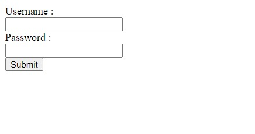
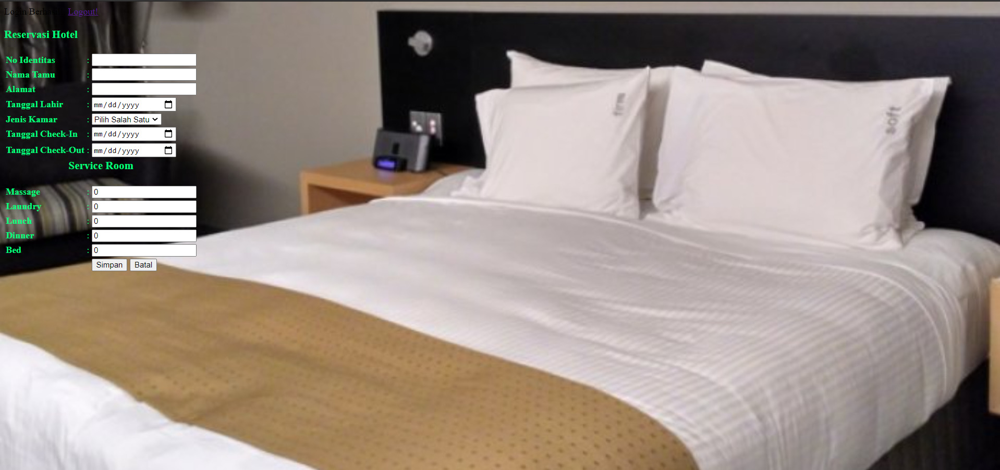
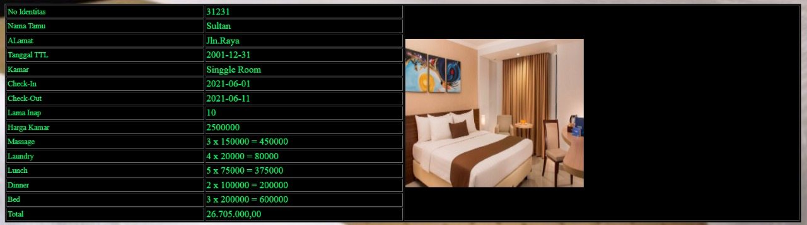
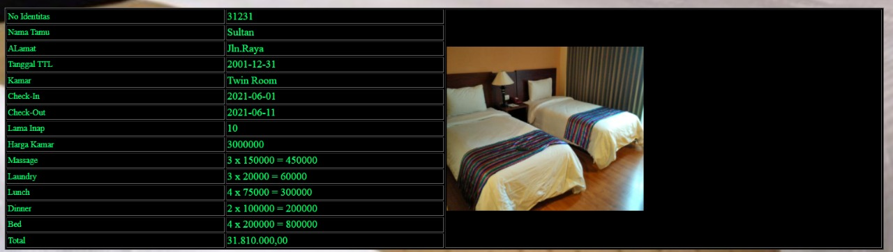
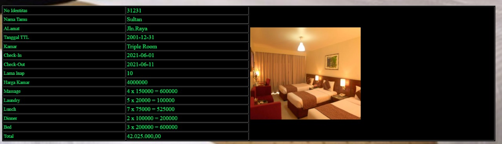
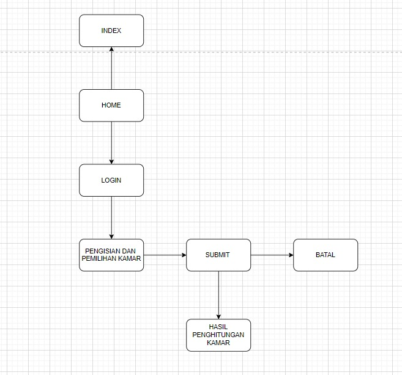

# Project Web Reservasi Hotel Sederhana 
### Final Project Kelompok 8
#### Nama Kelompok :
- Rendi Yusuf (19200727)
- Syachrizal Sultan Naji (19201073)
- Aryo Putranto Pramudityas (19200302)
 - Ayu Intan Putri Maharani (19201100)

#### Penjelasan Tentang Project Web Reservasi Hotel Kelompok 8 :

Project Web Reservasi  Hotel Sederhana ini kami buat supaya orang bisa memesan kamar hotel sesuai dengan pesanan yang mereka inginkan.

Tema : Tempat Pemesanan Hotel Yang Nyaman Dan Mudah

Keunggulan : Mudah,Cepat,Aman,Dan Nyaman 
#### Fitur Fitur Web Reservasi Hotel Kelompok 8 :
- Login
- Pengisian data tamu seperti : No identitas,Nama,Alamat,Tanggal Lahir,
- Pengisian tanggal Check In dan Check Out
- Pemilihan kamar
- Pemiihan Service Hotel seperti : Massage,Laundry,Bed,Lunch,Dinner
#### Screenshot Dan Tampilan Website :
**Login :**

**Home :**

**Single Room :**

**Twin Room :**

**Triple Room :**

**Struktur Navigasi Web :**

